<div align="center">



<br><br>

<table>
  <tr>
    <td width="380" align="center" style="border: none;">
      
    </td>
    <td width="500" align="center" style="border: none;">
      
    </td>
  </tr>
</table>

</div>

<br>

<h3 align="center">$ whoami</h3>

```text
 Joshua  ·  @jkw16
 building apps · breaking them · shipping
```

<h3 align="center">$ ls ~/projects</h3>

- **muse-bridge** — headless tunnel that lets an iOS app relay tasks to a local Claude CLI
- **Octane Social Driving** — social driving iOS app ([@jkw16/Octane-Social-Driving](https://github.com/jkw16/Octane-Social-Driving))

<h3 align="center">$ uptime</h3>

- 🔭 now: push-notification bridges, bug hunting, tooling
- 🌱 learning: hardening everything i ship
- ⚡ fun fact: this page rebuilds itself every day — the heatmap above is scraped and re-rendered by a GitHub Action

<br>

> Profile art method from [avivashishta's guide](https://www.avivashishta.com/blog/build-animated-github-profile-readme) — self-contained animated SVGs (CSS keyframes/SMIL inside ``), refreshed daily by [update-profile-art.yml](.github/workflows/update-profile-art.yml).